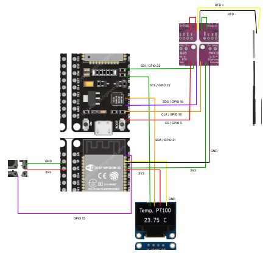

# Temperature_refrigerator
Este projeto consiste em um sistema completo de monitoramento de temperatura em tempo real, projetado para garantir que uma geladeira de culturas microbiológicas se mantenha dentro de uma faixa de temperatura ideal pré-definida (-6°C a 5°C).

O sistema utiliza um microcontrolador ESP32 para ler a temperatura de um sensor PT100 de alta precisão através de um amplificador MAX31865. Os dados são processados e exibidos localmente em um display OLED, que permite ao usuário alternar entre a visualização da temperatura atual, mínima e máxima registradas através de um botão físico. Um LED de alerta fornece um feedback visual imediato caso a temperatura saia da faixa ideal.

Paralelamente, o ESP32 se conecta a uma rede Wi-Fi e publica os dados de temperatura e de status (OK, ACIMA, ABAIXO) em um broker MQTT local. Um servidor de backend (escrito em Node.js) se inscreve nesses tópicos, armazena cada leitura em um banco de dados MongoDB para análise histórica e, ao mesmo tempo, serve uma dashboard web.

A dashboard web exibe os dados em tempo real, temperatura mínima e máxima registrada nas últimas 24 horas, gráficos da variação de temperatura minuto a minuto das últimas 24 horas e uma tabela com o registro definido em três horários do dia.

## Hardware utilizado:
- ESP32
- Sensor PT100
- Módulo MAX31865
- Display OLED 128x64 0.96" I2C 
- Módulo Interruptor Botão 12x12
- Protoboard
- Jumpers

### Funcionalidades Principais
- Medição Precisa: Leitura de temperatura com sensor PT100 e calibração por software (importante que seja feita a calibração do seu sensor).
- Display Local: Tela OLED que exibe a temperatura Atual, Mínima e Máxima, controlada por um botão.
- Alerta Visual: Um LED acende imediatamente se a temperatura estiver fora da faixa ideal de -6°C a 5°C ou em caso de falha no sensor.
- Conectividade Wi-Fi: O dispositivo se conecta a uma rede local.
- Comunicação MQTT: Publica a temperatura e o status em tópicos MQTT distintos, permitindo a integração com outros sistemas.
- Armazenamento de Dados: Um servidor backend Node.js armazena todas as leituras em um banco de dados MongoDB para persistência e análise.
- Dashboard Web em Tempo Real: Uma página web exibe a temperatura atual (atualizada via WebSockets), estatísticas e gráficos da variação de temperatura ao longo do tempo.

### Componentes do Sistema
O projeto é dividido em três partes principais:
1. Hardware Embarcado (ESP32): O dispositivo físico que realiza a medição e a publicação dos dados.
2. Serviços de Backend (PC Local): O broker MQTT, o banco de dados MongoDB e o servidor Node.js que atua como ponte.
3. Frontend (Navegador Web): A dashboard visual para monitoramento.

### Como Executar o Projeto

Siga os passos abaixo para configurar e executar o sistema completo.

1. Pré-requisitos de Software
Garanta que você tem os seguintes softwares instalados na sua máquina de desenvolvimento:
- Node.js: Para executar o servidor de backend.
  
Faça o download conforme seu sistema operacional, no site: `https://www.nodejs.tech/pt-br/download`

Siga os passos de instalação do instalador.

- MongoDB Community Server: O banco de dados para armazenar os dados. (Recomenda-se instalar também o MongoDB Compass para visualização).

Faça o download do MongoDB no site: `https://www.mongodb.com/try/download/community`

Siga os passos de instalação do instalador.

- Mosquitto MQTT Broker: O intermediário para as mensagens MQTT.

Faça o download do mosquito, no site: `https://mosquitto.org/download/`

Siga os passos de instalação do instalador.

> Observação: No Windows pode ocorrer problema com o firewall relacionado a porta que o Broker irá utilizar, para habilitar essa permissão faça uma regra de firewall como a descrita abaixo.

Aperte os botões `Windows + R` simultaneamente e digite wf.msc;\
Clique em Regras de Entrada, ao lado clique em Nova Regra;\
Selecione a opção Porta e avançar;\
Na próxima tela deixe a opção TCP marcada, e na parte `Portas locais específicas`, digite a porta do Broker por padrão é `1883` e clique em avançar;\
Agora deixe na opção `Permitir a conexão` e avançar;\
Nessa nova etapa pode deixar as duas primeiras opções marcadas e avançar;\
Para finalizar dê um nome para a regra (Ex: Mosquitto 1883) e aperte em concluir.\

- Editor de Código: VS Code com a extensão oficial do ESP-IDF na versão v5.4.1.

Faça o download do VS Code no site: `https://code.visualstudio.com/download`

Siga os passos de instalação do instalador.

Após instalado vá no menu lateral na opção extensões e procure por ESP-IDF e faça a instalação.

Após isso configure a extensão ESP-IDF para versão 5.4.1 seguindo o tutorial do link: `https://github.com/espressif/vscode-esp-idf-extension`

2. Montagem do Hardware
Conecte todos os componentes ao ESP32 conforme as tabelas abaixo.

Atenção: É altamente recomendado alimentar o ESP32 com uma fonte externa estável de 5V e 2A (como um carregador de celular) para evitar falhas de leitura do sensor quando o Wi-Fi estiver ativo.



| Periférico | Fiação | 
| -------- | ----- |
| Display OLED (I2C)| GND -> GND, VCC -> 3V3, SCK -> GPIO22, SDA -> GPIO21 |
| MAX31865 (SPI)|GND -> GND, 3V3 -> 3V3, CLK -> GPIO18, SDI -> GPIO23, SDO -> GPIO19, CS -> GPIO5|
| Sensor PT100 (2 Fios)| Fios do sensor em F+ e RTD-. Jumpers conectando F+ a RTD+ e F- a RTD-.|
| Botão (Módulo 3 pinos)| GND -> GND, VCC -> 3V3, OUT -> GPIO32|

3. Configuração e Execução do Firmware (ESP32)
   
    1.	Clone ou baixe este repositório.
    2.	Abra o projeto na sua IDE (ex: VS Code).
    3.	Edite o arquivo main/main.c e configure os seguintes parâmetros:
        - WIFI_SSID e WIFI_PASSWORD com os dados da sua rede Wi-Fi.
        - MQTT_BROKER_URL com o endereço IP do computador onde o Mosquitto está rodando.
        -	TEMP_OFFSET com o valor de calibração que você encontrou no teste do banho de gelo.
    4.	Conecte o ESP32 ao computador.
    5.	Execute o comando para compilar, gravar e monitorar:

```
idf.py flash monitor
```

4. Configuração e Execução do Backend
    1.	Navegue até a pasta do projeto Node.js (ex: dashboard_web) no seu terminal.
    2.	Instale as dependências:

    ```
    npm install express mongodb mqtt ws
    ```
    3.	Garanta que os serviços do MongoDB estejam rodando. 
    4.	Inicie o Mosquitto seguindo os passos:
   
        -	Navegue até o diretório de instalação do Mosquitto e edite o arquivo de configuração mosquitto.conf com um editor de texto.
        -	Adicione as seguintes linhas ao final do arquivo para habilitar o listener na porta padrão e permitir conexões anônimas. Salve o arquivo.
            ```
            listener 1883
            allow_anonymous true
            ```
        -	Abra um terminal (como administrador no Windows) e navegue até o diretório de instalação do Mosquitto.
        -	Inicie o broker com o seguinte comando para carregar a configuração e exibir logs de conexão no console:
            ```
            mosquitto -c mosquitto.conf -v
            ```

    6.	Inicie o servidor de backend:

        ```
      	node server.js
        ```

Você deverá ver mensagens confirmando a conexão com o MongoDB e o broker MQTT.

5. Acessando o Dashboard
   
    1.	Com o ESP32 e o server.js rodando, abra seu navegador de internet.
    2.	Acesse o endereço: `http://localhost:3000`
    3.	O dashboard deve carregar, exibir os dados históricos e começar a receber as atualizações de temperatura em tempo real.
